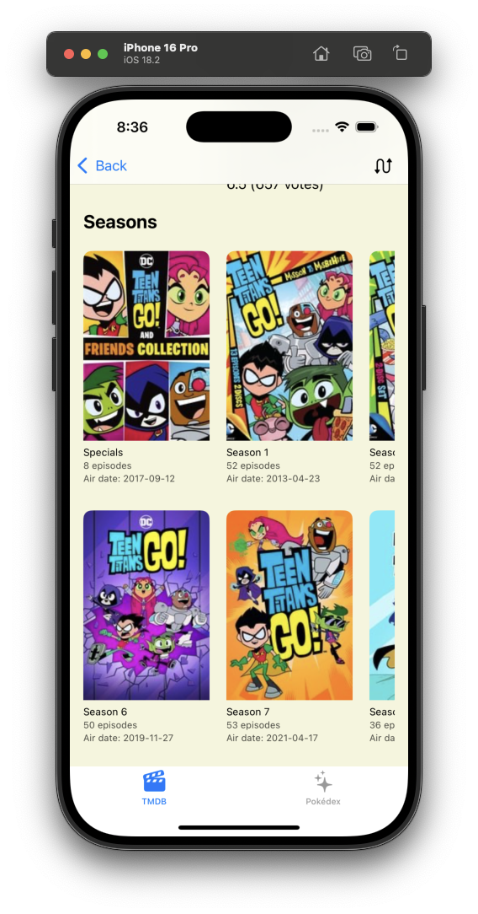
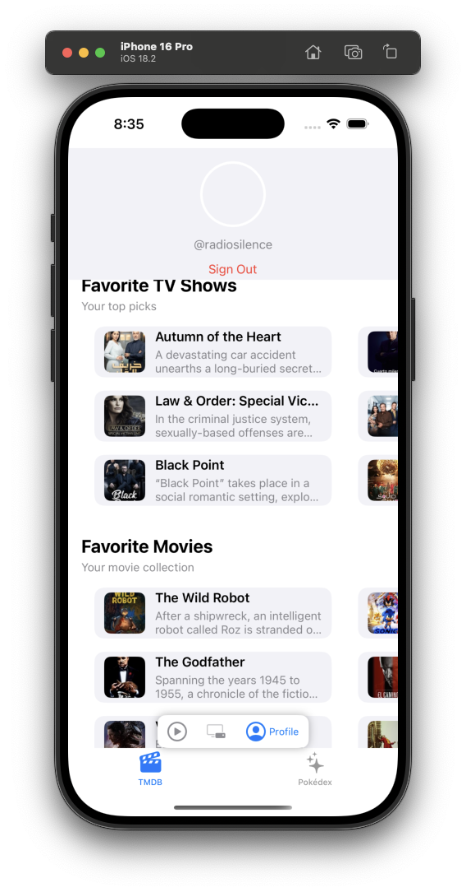

iOS Best Practices Demo Project
=============================

This repository serves its purpose as  comprehensive iOS project demonstrating current best practices and modern iOS development approaches. It tries to replicate as many best practices as possible across mulitple iOS architectures and free public APIs. Testflight: https://testflight.apple.com/join/FaXX2mUY

<details>
<summary>How to enable Pokedex on TestFlight version</summary>

Please search for a Pokemon film and click on "Pocket Monster" keyword from detail page to enable Pokedex tab.

</details>

<details>
<summary>Getting started</summary>
Create a xcconfig file with this pattern in Build.xcconfig:

```
TMDB_API_KEY=
PRODUCT_BUNDLE_IDENTIFIER=
```

Also adding a GoogleService-Info.plist file to the root of the project for Firebase Analytics. (Or setting the false flag in Rebuild/Rebuild/RebuildApp.swift to skip Firebase Analytics)

</details>


- [iOS Best Practices Demo Project](#ios-best-practices-demo-project)
- [Overview](#overview)
  - [Screenshots](#screenshots)
    - [Screens](#screens)
    - [Special Features](#special-features)
- [Practices](#practices)
  - [Architecture \& Design](#architecture--design)
    - [Feature based Modularization:](#feature-based-modularization)
    - [Navigation](#navigation)
  - [Security](#security)
  - [Testing](#testing)
  - [Development Tools, Build tools \& Automation](#development-tools-build-tools--automation)
  - [UI/UX](#uiux)
    - [Multiple themes](#multiple-themes)
  - [Other app features](#other-app-features)
- [Project Structure](#project-structure)
  - [CI/CD](#cicd)
  - [Collaboration](#collaboration)


# Overview 

What you'll find looking at this repo:
- feature based modularization with Swift packages
- VIPER, Clean & MVVM, SwiftUI & UIKit
- REST API & GraphQL networking & OAuth 
- SwiftGen, SwiftLint, SwiftFormat
- GitHub CI build & test

## Screenshots

### Screens

<div class="table-wrapper" markdown="block" style="overflow-x: auto; white-space: nowrap;">

|TMDB| Movie List | TV list | search & filters | TV Detail | Profile | endless loading |
|-|-|-|-|-|-|-|
|-|||||||
|Pokedex|Poke list|Pokemon detail|
|-|||

</div>

### Special Features

| Design Switching | Theme Switching |
|---------|------|
|  |  |

# Practices

## Architecture & Design

### Feature based Modularization:

✅ Using Swift Package Manager to manage dependencies and only leaving a thin app shell using Xcode project. This is way more Git friendly than using Xcode project. However, it's still debatable if this is better than using new XC16 buildable folders (Package.swift at root level is also difficult to setup on latest Xcode version.). 
    - Pros: Swift, readable & Git friendly 
    - Cons: code suggestions, previews not as smooth as using Xcode project, coverage report also not ignoring test files.

Swinject are used for dependency injection.

Details of packages:
- **TMDB_MVVM_Detail**: Showing details of a movie including overview, cast, crew, keywords, etc. Using **SwiftUI** and **MVVM architecture**. 
- **TMDB_Discover**: Display list of TV shows (from "up in the air" or "airing today" TMDB API) using **Clean Architecture** and **SwiftUI**.
- **TMDB_Feed**: same as TMDB_Discover but using **MVVM architecture**. Also supports endless loading
- **TMDB_Clean_Profile**: Handling authentication and displaying user profile (including avatar, favourite movies & TV shows & watchlist). Using **Clean Architecture** and **UIKit** and **Combine** for concurrency.
- **TMDB_TVShowDetail**: Showing details of a TV show including overview, cast, crew, TV seasons. Using **SwiftUI** and Data Store pattern. **Support multiple themes**.
- **Pokedex_Pokelist**: loading a Pokemon list from Pokedex **GraphQL** API. Using **VIPER** architecture and **UIKit**
- **Pokedex_Detail**: loading a Pokemon detail from Pokedex **GraphQL** API. Using RxSwift & RxCocoa for reactive programming. MVVM architecture.

### Navigation

Using Router Pattern, `NavigationStack` and Coordinator pattern

#### TMDB Navigation Matrix

The TMDB section uses a Coordinator pattern with NavigationStack for routing between screens. Below is a comprehensive matrix showing navigation capabilities:

**Tab Routes (Root Level)**
- Movie Feed (`movieFeed`)
- Marketplace/Discover (`marketplace`)
- Profile (`profile`)

**Navigation Destinations**

| From Screen | To Screen | Route Type | Status | Notes |
|------------|-----------|------------|--------|-------|
| **Movie Feed** | Movie Detail | `TMDBRoute.movieDetail` | ✅ | Tap on movie in feed |
| **Movie Feed** | TV Show Detail | `TMDBRoute.tvShowDetail` | ✅ | Tap on TV show in feed |
| **Movie Feed** | Movie List (Filtered) | `TMDBRoute.movieList` | ✅ | Apply filters/search |
| **Marketplace/Discover** | Movie Detail | `TMDBRoute.movieDetail` | ✅ | Tap on trending movie |
| **Marketplace/Discover** | TV Show Detail | `TMDBRoute.tvShowDetail` | ✅ | Tap on trending TV show |
| **Marketplace/Discover** | TV Show List | `TMDBRoute.tvShowList` | ✅ | Tap genre/cast/on-the-air |
| **Profile** | Movie Detail | `TMDBRoute.movieDetail` | ✅ | Tap favorite/watchlist movie |
| **Profile** | TV Show Detail | `TMDBRoute.tvShowDetail` | ✅ | Tap favorite/watchlist TV show |
| **Movie Detail** | Movie List (by Keyword) | `TMDBRoute.movieList(.keyword)` | ✅ | Tap keyword tag |
| **Movie Detail** | Cast/Crew Detail | 🔴 | Not implemented | No route for person detail |
| **TV Show Detail** | Season Detail | 🔴 | Not implemented | Internal to TVShowDetail |
| **TV Show Detail** | Cast Detail | 🔴 | Not implemented | No route for person detail |
| **TV Show List** | TV Show Detail | `TMDBRoute.tvShowDetail` | ✅ | Tap TV show in filtered list |
| **Movie List** | Movie Detail | `TMDBRoute.movieDetail` | ✅ | Tap movie in filtered list |
| **Any Screen** | Person/Cast Detail | 🔴 | Missing | Would need `TMDBRoute.personDetail` |

**Navigation Parameters**

1. **`TMDBRoute.movieDetail(MovieRouteModel)`**
   - Required: movie ID
   - Optional: title, overview, poster path, backdrop path, vote average, etc.

2. **`TMDBRoute.tvShowDetail(Int)`**
   - Required: TV show ID

3. **`TMDBRoute.movieList(AdditionalMovieListParams)`**
   - Supports: keyword filtering, genre filtering, cast filtering
   - Example: `.movieList(.keyword(123))`

4. **`TMDBRoute.tvShowList(TVShowFeedType)`**
   - Supports: `.onTheAir`, `.discoverWithGenre`, `.discoverWithTVGenre`, `.discoverWithCast`

**Missing Navigation Routes**
- 🔴 Person/Cast Detail page (tap on actor/crew member)
- 🔴 Season Detail page (separate from TV show detail)
- 🔴 Episode Detail page
- 🔴 Reviews/Comments page
- 🔴 Similar Movies/TV Shows (currently might be handled via movieList/tvShowList)

## Security

- Secure Credential Management
    - ✅ API keys stored in GitHub Secrets for CI/CD and read when running workflows (see .github/workflows/ci.yml)
    - ✅ Sensitive tokens (`session_id` here) stored in iOS Keychain after authentication (see TMDB_Shared_Backend module)

## Testing

🚧 Testing: 
- ✅ 100% code coverage for TMDB_Discover module. For testabbility purpose:
    - Data layer & domain layer should be wrapped in protocol for easy mocking. Mocking `URLProtocol` is for testing URLSession Task creation.
    - Using ViewInspector library for SwiftUI unit testing.

## Development Tools, Build tools & Automation

- ✅ Code Generation
    - 🔴 Sourcery for mock generation
    - ✅ SwiftGen for type-safe assets and localizations (Note: SwiftGen still not supporting Xcode 15 String catalog so this project still use .strings files.)
    - 
- ✅ Linting & Formatting: run `swiftformat .` or `swift package plugin swiftlint` at project root level
  - SwiftFormat and SwiftLint are also run as "run script phase" in Xcode build settings.
  - ✅ SwiftLint is also run as a GitHub Action workflow, Linting on every pull request. (SwiftLint doesn't work well with `// swiftlint:disable` comments on Ubuntu)

</details>

## UI/UX

- 🚧 UI Development
    - ✅ SwiftUI Previews for all UI components, including `UIView` and `UIViewController`, 
        - 🚧 Preview should be covering all states from view models.
    - 🚧 Demo implementations for all UI modules

### Multiple themes

- ✅ Support multiple themes:
    - ✅ Light theme
    - ✅ Dark theme
    - ✅ Sepia theme
    - ✅ System theme

## Other app features

Tracking:
- ✅  Using Firebase Analytics for tracking events with abstraction to avoid direct dependency of each module.
  - GoogleService-Info.plist is ignored by Git and should be set as a secret in GitHub.

# Project Structure
## CI/CD

Using GitHub Actions for CI/CD.
- ✅ ios.yml and test.sh files can generate coverage report for modules with tests. 3 actions workflow:
  - SwiftLint run
  - Build project
  - Test pre-defined schemes on available simulators
- 🔴 upload to TestFlight (or BrowserStack, Remote Testkit, etc.)

## Collaboration

Setup on GitHub for team collaboration:
- ✅ automatically running unit tests and code coverage on newly opened pull requests. (Due to SwiftPM limitation mentioned above, test.sh using a custom command of `xcrun llvm-cov` instead of a normal xctestplan file) 
- 🚧 Block merging pull requests unless certain conditions are met (e.g. code coverage is 100%, 2 approvals from other team members, etc.)


Progress status is classified as: ✅ Finished 🚧 In Progress 🔴 Not Started 🔔 Finished but needs updates