iOS Best Practices Demo Project
=============================

This repository serves its purpose as  comprehensive iOS project demonstrating current best practices and modern iOS development approaches. It tries to replicate as many best practices as possible across mulitple iOS architectures and free public APIs. Testflight: https://testflight.apple.com/join/FaXX2mUY

<details>
<summary>How to enable Pokedex on TestFlight version</summary>

Please search for a Pokemon film and click on "Pocket Monster" keyword from detail page to enable Pokedex tab.

</details>

<details>
<summary>Getting started</summary>
Copy `Rebuild/Rebuild/Build.xcconfig.template` to `Rebuild/Rebuild/Build.xcconfig` (gitignored) and fill in:

```
TMDB_API_KEY=
PRODUCT_BUNDLE_IDENTIFIER=
```

Also adding a GoogleService-Info.plist file to the root of the project for Firebase Analytics. (Or setting the false flag in Rebuild/Rebuild/RebuildApp.swift to skip Firebase Analytics)

Movie detail soundtrack search needs Apple Music access (`NSAppleMusicUsageDescription` is already in `Rebuild/Rebuild/Info.plist`).

</details>


- [iOS Best Practices Demo Project](#ios-best-practices-demo-project)
- [Overview](#overview)
  - [Screenshots](#screenshots)
    - [Special Features](#special-features)
    - [Screens](#screens)
      - [TMDB](#tmdb)
      - [Pokedex](#pokedex)
    - [Design inspirations](#design-inspirations)
      - [Small projects](#small-projects)
      - [Commercial apps](#commercial-apps)
      - [Large open source apps](#large-open-source-apps)
- [Best Practices](#best-practices)
  - [Security](#security)
  - [Testing](#testing)
  - [Development Tools, Build tools \& Automation](#development-tools-build-tools--automation)
  - [UI/UX](#uiux)
    - [Multiple themes](#multiple-themes)
  - [Other app features](#other-app-features)
- [Project Structure](#project-structure)
  - [CI/CD](#cicd)
  - [Collaboration](#collaboration)
  - [Architecture \& Design](#architecture--design)
    - [Navigation](#navigation)
      - [TMDB Navigation Matrix](#tmdb-navigation-matrix)
    - [Feature based Modularization:](#feature-based-modularization)
      - [Module Architecture Overview](#module-architecture-overview)
      - [Module Architecture Layers](#module-architecture-layers)


# Overview 

What you'll find looking at this repo:
- feature based modularization with Swift packages
- VIPER, Clean & MVVM, SwiftUI & UIKit
- REST API & GraphQL networking & OAuth 
- MusicKit soundtrack search, Swiftfin/Jellyfin client, CoverFlow carousel
- SwiftGen, SwiftLint, SwiftFormat
- GitHub CI build & test

## Screenshots

### Special Features

<div style="overflow-x: auto; white-space: nowrap; -webkit-overflow-scrolling: touch;">
  <table>
    <thead>
      <tr>
        <th>Design Switching</th>
        <th>Theme Switching</th>
      </tr>
    </thead>
    <tbody>
      <tr>
        <td>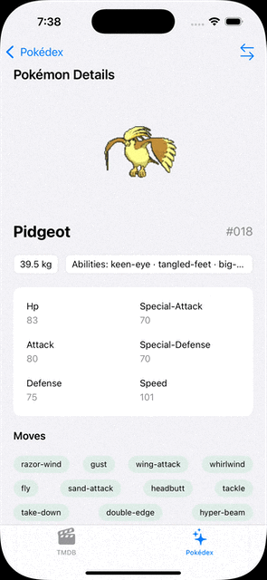</td>
        <td>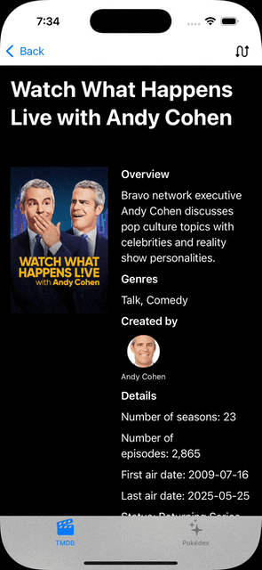</td>
      </tr>
    </tbody>
  </table>
</div>

### Screens
#### TMDB

<div style="overflow-x: auto; white-space: nowrap; -webkit-overflow-scrolling: touch;">
  <table style="width: auto; table-layout: auto;">
    <thead>
      <tr>
        <th>TMDB</th>
        <th>Movie List</th>
        <th>TV list</th>
        <th>search & filters</th>
        <th>Movie Detail</th>
        <th>TV Detail</th>
        <th>Profile</th>
        <th>endless loading</th>
      </tr>
    </thead>
    <tbody>
      <tr>
        <td></td>
        <td style="width: 200px;">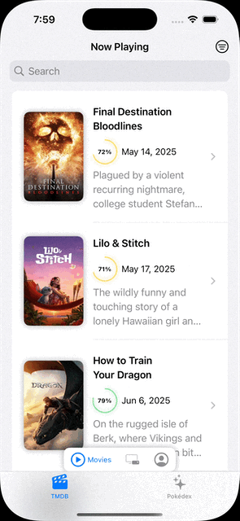</td>
        <td style="width: 300px;">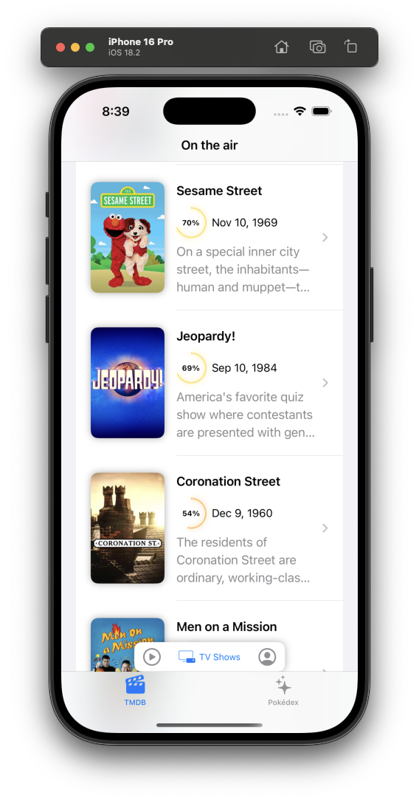</td>
        <td style="width: 200px;">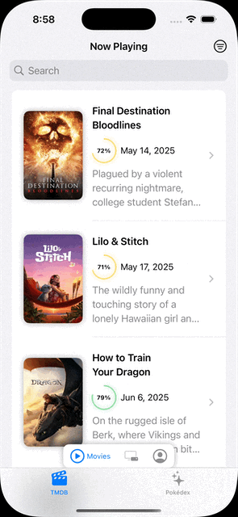</td>
        <td style="width: 200px;">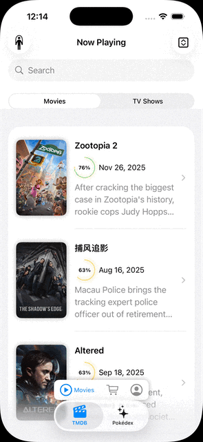</td>
        <td style="width: 200px;">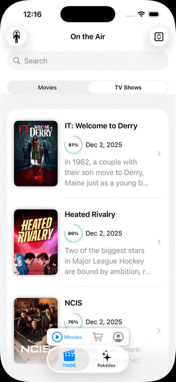</td>
        <td style="width: 200px;">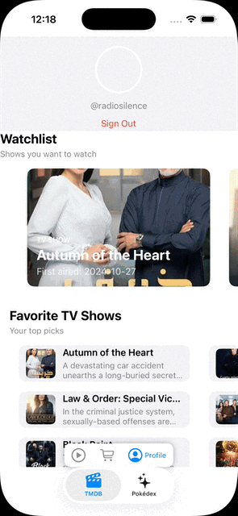</td>
        <td style="width: 200px;"></td>
      </tr>
    </tbody>
  </table>
</div>

#### Pokedex

<div style="overflow-x: auto; white-space: nowrap; -webkit-overflow-scrolling: touch; margin-top: 20px;">
  <table>
    <thead>
      <tr>
        <th>Pokedex</th>
        <th>Poke list</th>
        <th>Pokemon detail</th>
      </tr>
    </thead>
    <tbody>
      <tr>
        <td></td>
        <td>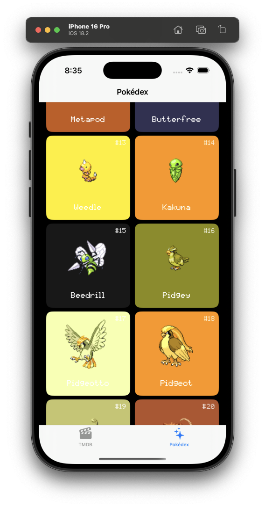</td>
        <td>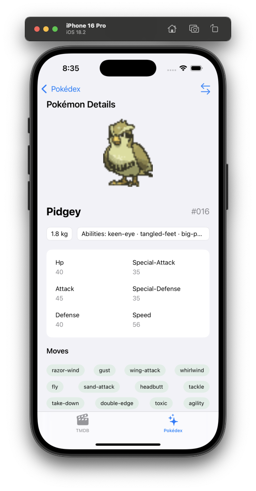</td>
      </tr>
    </tbody>
  </table>
</div>

### Design inspirations
#### Small projects

#### Commercial apps

<table>
  <tr>
    <th>Screen name</th>
    <th>Home screen</th>
  </tr>
  <tr>
    <td></td>
    <td style="padding: 80px 120px;">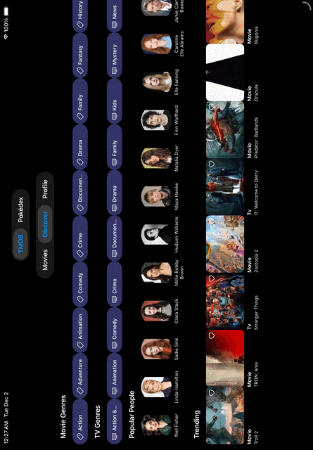</td>
  </tr>
  <tr>
    <td>Reference</td>
    <td>My TMDB_Discover module</td>
  </tr>
  
</table>

#### Large open source apps

# Best Practices

## Security

- Secure Credential Management
    - ✅ API keys stored in GitHub Secrets for CI/CD and read when running workflows (see .github/workflows/ci.yml)
    - ✅ Sensitive tokens (`session_id` here) stored in iOS Keychain after authentication (see TMDB_Shared_Backend module)

## Testing

🚧 Testing: 
- ✅ 100% code coverage for TMDB_Discover module. For testabbility purpose:
    - Data layer & domain layer should be wrapped in protocol for easy mocking. Mocking `URLProtocol` is for testing URLSession Task creation.
    - Using ViewInspector library for SwiftUI unit testing.
- 🚧 `TMDB_MovieDetail_Tests` covers MusicKit soundtrack query building (`MovieOSTSearchQueryBuilder`).

## Development Tools, Build tools & Automation

- ✅ Code Generation
    - 🔴 Sourcery for mock generation
    - ✅ SwiftGen for type-safe assets and localizations (Note: SwiftGen still not supporting Xcode 15 String catalog so this project still use .strings files.)
    - 
- ✅ Linting & Formatting: run `swiftformat .` or `swift package plugin swiftlint` at project root level
  - SwiftFormat and SwiftLint are also run as "run script phase" in Xcode build settings.
  - ✅ SwiftLint is also run as a GitHub Action workflow, Linting on every pull request. (SwiftLint doesn't work well with `// swiftlint:disable` comments on Ubuntu)

</details>

## UI/UX

- 🚧 UI Development
    - ✅ SwiftUI Previews for all UI components, including `UIView` and `UIViewController`, 
        - 🚧 Preview should be covering all states from view models.
    - 🚧 Demo implementations for all UI modules

### Multiple themes

- ✅ Support multiple themes:
    - ✅ Light theme
    - ✅ Dark theme
    - ✅ Sepia theme
    - ✅ System theme

## Other app features

Tracking:
- ✅  Using Firebase Analytics for tracking events with abstraction to avoid direct dependency of each module.
  - GoogleService-Info.plist is ignored by Git and should be set as a secret in GitHub.

Media:
- ✅ Apple Music / MusicKit on movie detail (`MovieOSTViewModel` + `MovieOSTSection`): request authorization, search for soundtrack albums, and deep-link into Apple Music.
- ✅ Jellyfin via Swiftfin (`third_party/SwiftfinLaunchView`, launched from the Settings tab): embeds a Swiftfin client as a full-screen cover. Swiftfin is a local SwiftPM dependency (`quangDecember/Swiftfin`, `swiftpm` branch).
- ✅ Photo carousel + full-screen slides (`PhotoListViewer`): horizontal backdrop strip on movie detail, tapping opens `PhotoSlidesPage`.
- ✅ iPod-style CoverFlow (`Shared_UI_Support/Views/CoverFlow`, iOS 18+): used as an alternate filmography layout on the person page (toggle via the design-switch toolbar button).

# Project Structure
## CI/CD

Using GitHub Actions for CI/CD (macos-26 runners).
- ✅ Split workflows:
  - SwiftLint (`swiftlint.yml`)
  - Build (`ios.yml` + `build.sh`)
  - Test (`ios-test.yml` + `test-only.sh`) then a separate coverage job (`coverage-check.sh`) that downloads the test artifact
- 🔴 upload to TestFlight (or BrowserStack, Remote Testkit, etc.)

## Collaboration

Setup on GitHub for team collaboration:
- ✅ automatically running unit tests and code coverage on newly opened pull requests. (Due to SwiftPM limitation mentioned above, `coverage-check.sh` uses a custom `xcrun llvm-cov` command instead of a normal xctestplan file) 
- 🚧 Block merging pull requests unless certain conditions are met (e.g. code coverage is 100%, 2 approvals from other team members, etc.)


Progress status is classified as: ✅ Finished 🚧 In Progress 🔴 Not Started 🔔 Finished but needs updates


## Architecture & Design


### Navigation

Using Router Pattern, `NavigationStack` and Coordinator pattern

#### TMDB Navigation Matrix

The TMDB section uses a Coordinator pattern with NavigationStack for routing between screens. Below is a comprehensive matrix showing navigation capabilities:

**Tab Routes (Root Level)**
- Movie Feed (`movieFeed`)
- Marketplace/Discover (`marketplace`)
- Profile (`profile`)
- Settings (`settings`) — launches Swiftfin/Jellyfin

**Navigation Destinations**

| From Screen | To Screen | Route Type | Status | Notes |
|------------|-----------|------------|--------|-------|
| **Movie Feed** | Movie Detail | `TMDBRoute.movieDetail` | ✅ | Tap on movie in feed |
| **Movie Feed** | TV Show Detail | `TMDBRoute.tvShowDetail` | ✅ | Tap on TV show in feed |
| **Movie Feed** | Movie List (Filtered) | `TMDBRoute.movieList` | ✅ | Apply filters/search |
| **Marketplace/Discover** | Movie Detail | `TMDBRoute.movieDetail` | ✅ | Tap on trending movie |
| **Marketplace/Discover** | TV Show Detail | `TMDBRoute.tvShowDetail` | ✅ | Tap on trending TV show |
| **Marketplace/Discover** | Person Detail | `TMDBRoute.personDetail` | ✅ | Tap cast chip or trending person |
| **Marketplace/Discover** | TV Show List | `TMDBRoute.tvShowList` | ✅ | Tap genre/on-the-air |
| **Profile** | Movie Detail | `TMDBRoute.movieDetail` | ✅ | Tap favorite/watchlist movie |
| **Profile** | TV Show Detail | `TMDBRoute.tvShowDetail` | ✅ | Tap favorite/watchlist TV show |
| **Movie Detail** | Movie List (by Keyword) | `TMDBRoute.movieList(.keyword)` | ✅ | Tap keyword tag |
| **Movie Detail** | Person Detail | `TMDBRoute.personDetail` | ✅ | Tap cast/crew member |
| **Movie Detail** | Photo Slides | `TMDBRoute.photoSlides` | ✅ | Tap backdrop in photo carousel |
| **Person Detail** | Movie Detail | `TMDBRoute.movieDetail` | ✅ | Tap a filmography credit |
| **TV Show Detail** | Season Detail | 🔴 | Not implemented | Internal to TVShowDetail |
| **TV Show Detail** | Cast Detail | 🔴 | Not implemented | No person route from TV detail yet |
| **TV Show List** | TV Show Detail | `TMDBRoute.tvShowDetail` | ✅ | Tap TV show in filtered list |
| **Movie List** | Movie Detail | `TMDBRoute.movieDetail` | ✅ | Tap movie in filtered list |

**Navigation Parameters**


**Missing Navigation Routes**
- 🔴 Person/Cast Detail from TV show detail (movie detail and Discover already route to `TMDBRoute.personDetail`)
- 🔴 Season Detail page (separate from TV show detail)
- 🔴 Episode Detail page
- 🔴 Reviews/Comments page
- 🔴 Similar Movies/TV Shows (currently might be handled via movieList/tvShowList)

### Feature based Modularization:

✅ Using Swift Package Manager to manage dependencies and only leaving a thin app shell using Xcode project. This is way more Git friendly than using Xcode project. However, it's still debatable if this is better than using new XC16 buildable folders (Package.swift at root level is also difficult to setup on latest Xcode version.). 
    - Pros: Swift, readable & Git friendly 
    - Cons: code suggestions, previews not as smooth as using Xcode project, coverage report also not ignoring test files.

Swinject are used for dependency injection.

#### Module Architecture Overview

UI framework → architecture → reactive layer:

- 🍏 **SwiftUI:**
    - 🧩 **MVVM:**
        - 🔗 **Combine:**
            - **TMDB_Feed**
            - **TMDB_MovieDetail**
    - 🗄️ **Data Store** (👁️ `@Observable`):
        - **TMDB_TVShowDetail**
        - **TMDB_Person**
    - 🧭 **Coordinator:** with 🔗 **Combine:**: **TMDB**, **everythingclient**
- 🍏 **SwiftUI** + 📱 **UIKit:**
    - 🏛️ **Clean Architecture:**
        - **TMDB_Discover**
- 📱 **UIKit:**
    - ⚡ **VIPER:**
        - **Pokedex & Pokedex_Pokelist**
    - 🧩 **MVVM:**
        - 🌀 **RxSwift:**
            - **Pokedex_Detail**
    - 🏛️ **Clean Architecture:**
        - 🌀 **RxSwift:**
            - **TMDB_Profile**

Shared and supporting packages: **PhotoListViewer**, **TMDB_Shared_UI**, **CoreFeatures**, **Shared_UI_Support**, **TMDB_Shared_Backend**, **Pokedex_Shared_Backend**, **third_party**, **Integration_test**.


#### Module Architecture Layers

Folder structure for each module. Headings list **architecture**, then **UI** (SwiftUI / UIKit), then **state** (Combine / RxSwift / `ObservableObject`).

**Pokedex** (Coordinator · SwiftUI + UIKit · Combine)
```
Pokedex/
├── PokedexView.swift
└── Router/
    └── PokelistRouter.swift
```

**Pokedex_Detail** (MVVM · UIKit · RxSwift)
```
Pokedex_Detail/
├── View/
│   ├── PokemonDetailViewController.swift
│   ├── PokemonContentDetailViewController.swift
│   └── LoadingViewController.swift
└── ViewModel/
    └── PokemonDetailViewModel.swift
```

**Pokedex_Pokelist** (VIPER · UIKit · async/await)
```
Pokedex_Pokelist/
├── Entities/
│   └── PokemonEntity.swift
├── Interactor/
│   └── PokelistInteractor.swift
├── Presenter/
│   └── PokelistPresenter.swift
├── View/
│   ├── PokelistViewController.swift
│   └── PokemonCell.swift
└── Protocols/
    └── PokelistProtocols.swift
```

**TMDB_Discover** (Clean Architecture · SwiftUI + UIKit · Combine / ObservableObject)
```
TMDB_Discover/
├── app/ (DI)
│   └── DiscoverAssembly.swift
├── data/
│   ├── datasource/
│   └── repositories/
├── domain/
│   ├── entities/
│   ├── repositories/
│   └── usecase/
└── presentation/
    ├── pages/
    ├── view_models/
    └── widgets/
```

**TMDB_Feed** (MVVM · SwiftUI · Combine / ObservableObject)
```
TMDB_Feed/
├── Backend/
│   └── APIServiceProtocol.swift
├── Model/
│   ├── MovieModel.swift
│   └── MovieListResponse.swift
├── ViewModels/
│   ├── MovieFeedViewModel.swift
│   └── TVShowFeedViewModel.swift
└── Views/
    ├── Pages/
    └── Widgets/
```

**TMDB_MovieDetail** (MVVM · SwiftUI · Combine / ObservableObject)
```
TMDB_MovieDetail/
├── Domain/
│   └── MovieOSTSearchQueryBuilder.swift
├── Model/
│   ├── Movie.swift
│   ├── People.swift
│   └── Genre.swift
├── ViewModels/
│   ├── MovieDetailViewModel.swift
│   ├── MovieCastingViewModel.swift
│   ├── MovieWatchProvidersViewModel.swift
│   └── MovieOSTViewModel.swift   // MusicKit soundtrack search
└── Views/
    ├── Pages/
    ├── Sections/                 // includes MovieOSTSection
    └── StaticViews/
```

**TMDB_Person** (Data Store · SwiftUI · ObservableObject)
```
TMDB_Person/
├── Views/
│   ├── PersonDetailPage.swift
│   ├── PersonDetailContent.swift
│   ├── PersonDetailHeaderView.swift
│   ├── PersonFactGrid.swift
│   ├── PersonBiographySection.swift
│   ├── PersonFilmographySection.swift
│   └── PersonFilmographyCarouselSection.swift  // CoverFlow, iOS 18+
└── Resources/
```

**third_party** (client wrapper · SwiftUI · none)
```
third_party/
└── Views/
    └── SwiftfinLaunchView.swift               // Jellyfin client
```

**PhotoListViewer** (view module · SwiftUI · none)
```
PhotoListViewer/
└── Views/
    ├── PhotoCarouselView.swift
    └── PhotoSlidesPage.swift
```

**TMDB_Profile** (Clean Architecture · UIKit · RxSwift, Combine for auth)
```
TMDB_Profile/
├── DI/
│   └── ProfileAssembly.swift
├── Data/
│   └── Repositories/
├── Domain/
│   ├── Entities/
│   ├── Repositories/
│   └── UseCases/
└── Presentation/
    ├── controllers/
    ├── ViewModels/
    └── Views/
```

**TMDB_TVShowDetail** (Data Store · SwiftUI · ObservableObject)
```
TMDB_TVShowDetail/
├── Views/
│   ├── TVShowDetailView.swift
│   ├── TVShowDetailContentView.swift
│   └── (Component views)
└── Resources/
```

